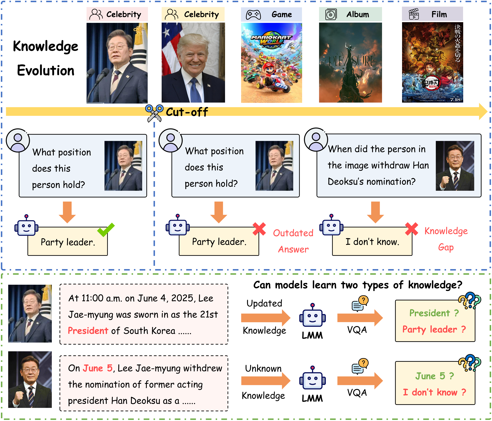
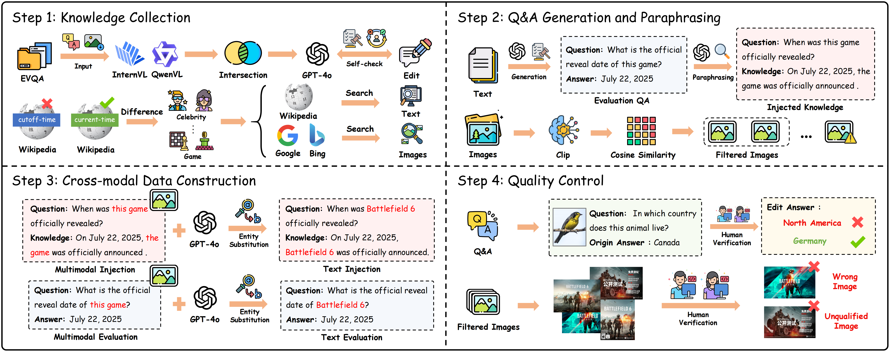

<!-- <div align="center">

<h1>MMKU-Bench: A Multi modal Update Benchmark for Diverse Visual Knowledge</h1>

<p>
  <a href="https://arxiv.org/abs/2603.15117" style="text-decoration:none; display:inline-block;">
    
  </a>
  <a href="https://huggingface.co/datasets/baochenfu/MMKU-Bench" style="text-decoration:none; display:inline-block;">
    
  </a>
  <a href="https://github.com/baochenfu/MMKU-Bench" style="text-decoration:none; display:inline-block;">
    
  </a>
</p>

</div> -->

<div align="center">

# MMKU-Bench: A Multimodal Update Benchmark for Diverse Visual Knowledge

[](https://arxiv.org/abs/2603.15117)
[](https://huggingface.co/datasets/baochenfu/MMKU-Bench)
[](https://github.com/baochenfu/MMKU-Bench)

</div>

## Table of Contents
- 🔔 [News](#news)
- 🌟 [Overview](#overview)
- 🤗 [Dataset](#dataset)
- 🛠️ [Requirements and Installation](#requirements-and-installation)
- 💥 [Inference](#inference)
- 🤖 [Evaluation](#evaluation)
  
## 🔔 News <a id="news"></a>

- **[2026.03.16]** Our paper is publicly available at 📄[arXiv](https://arxiv.org/abs/2603.15117)
- **[2026.02.03]** We release the MMKU-Bench dataset at 🤗 [Huggingface Dataset](https://huggingface.co/datasets/baochenfu/MMKU-Bench).
- **[2026.02.02]** Code is available now!

## 🌟 Overview <a id="overview"></a>

<p align="center">
  
</p>

We construct **MMKU-Bench**, a comprehensive benchmark for multimodal knowledge updating, using free-form natural language knowledge to evaluate the effectiveness, robustness, and logical consistency of various knowledge injection methods.


## 🤗 Dataset <a id="dataset"></a>

You can download 🤗**MMKU-Bench**  from the Hugging Face:
[MMKU-Bench](https://huggingface.co/datasets/baochenfu/MMKU-Bench).


The expected structure of files is:


```
MMKU-Bench
├── unknown
│   ├── images
│   ├── unknown_test_rewrite.jsonl
│   └── unknown_train_rewrite.json
└── updated
    ├── images
    ├── updated_test_rewrite.jsonl
    └── updated_train_rewrite.json
```
## 🛠️ Requirements and Installation<a id="requirements-and-installation"></a>

```
Please refer to the code repository:

https://github.com/modelscope/ms-swift

https://github.com/zjunlp/EasyEdit

https://github.com/open-compass/VLMEvalKit
```
## 💥 Inference <a id="inference"></a>

```
python inference.py \
  --input data/input.jsonl \
  --output data/output.jsonl \
  --model_path /path/to/InternVL2.5-sft
```
## 🤖 Evaluation <a id="evaluation"></a>

```
python evaluation/eval_acc_f1.py \
  --test_file data/vqa_test.jsonl \
  --inference_file results/inference.jsonl \
  --output_file results/eval_results.jsonl
```
